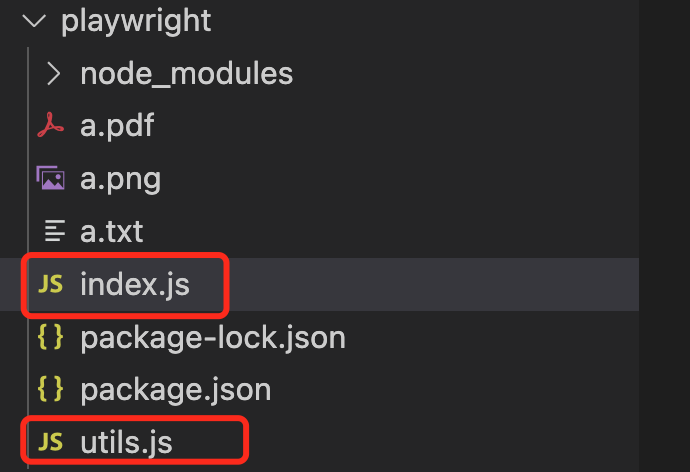

## 1.简介
[Playwright](https://playwright.dev/)是微软开源的一个UI自动化测试工具。
## 2.代码
通过使用该用工具可以很方便生成一些网页截图或者文件下载等功能,下面使用该工具实现一个简易的网页截图,utils.js代码如下:
``` nodejs
const {chromium} = require('playwright');

const playwright = async (url)=>{
	// 为了方便查看将headless 设置为false.
	const browser = await chromium.launch({headless:false})
	const page =await browser.newPage()

	await page.goto(url)
	const buffer = await page.screenshot({path:"a.png"})
	await page.pdf({path:"a.pdf"})

	await page.close()
	
	await browser.close()
	// return buffer.toString('base64')

}

module.exports=playwright
```

index.js代码如下:
``` nodejs
const playwright = require('./utils.js');
const fs = require('fs');

(async () => {
	await playwright('http://www.baidu.com')
	// const data = await playwright('http://www.baidu.com')
	// fs.writeFile("a.txt",data,(error,data)=>{
	// 	console.log('ok');
	// })
})()
```

## 3.项目结构

